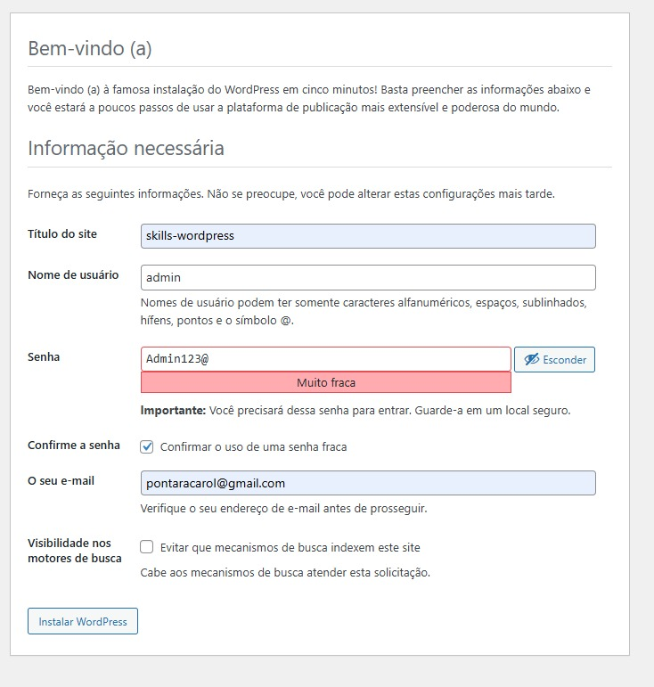
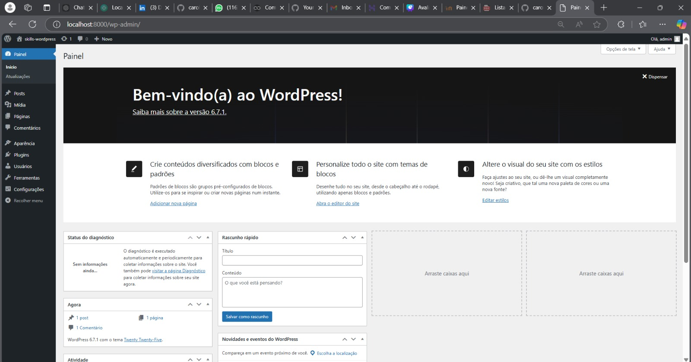

```markdown
# 🚀 Configuração do Ambiente e Instalação de Plugins WordPress com Docker

## 🛠️ 1. Instalação do Ambiente

### 🐳 Instalação do Docker Desktop
Certifique-se de que o Docker Desktop está instalado e em execução na sua máquina.  
📥 [Baixe aqui](https://www.docker.com/products/docker-desktop) o Docker Desktop se ainda não o tiver.

---

### 📂 Arquivo `docker-compose.yml`
Na pasta do seu projeto, havéra um arquivo chamado `docker-compose.yml`.
Ele criara uma imagem docker com BD e volumes Wordpress.

### ▶️ Subindo o ambiente com Docker Compose
Execute o comando abaixo para iniciar os containers:  

```bash
docker-compose up -d
```  

✅ Para verificar se os containers estão ativos:  

```bash
docker ps
```

---

## 🌐 2. Acessando o WordPress
Assim que o Docker Compose estiver ativo, acesse o WordPress em:  
🔗 [http://localhost:8000](http://localhost:8000).

---

## 🧩 3. Instalação e Ativação dos Plugins

### 🔑 Acesse o painel de administração do WordPress
1. Abra o painel:  
   [http://localhost:8000/wp-admin](http://localhost:8000/wp-admin)

2. Faça login ou crie uma conta.


Após isso, você verá uma tela como esta:  
📸 **Exemplo de tela:**  


---

### 📥 Adicionando e ativando os plugins
1. **Via interface gráfica:**  
   Acesse a página de plugins em:  
   [http://localhost:8000/wp-admin/plugins.php](http://localhost:8000/wp-admin/plugins.php).  

2. **Localizando plugins:**  
   Os plugins criados estão localizados em:  
   📂 `/wordpress/wp-content/plugins`.  

### 💡 Dica:
Após a instalação, não esqueça de ativar os plugins para garantir o funcionamento correto.

---

## 🙏 Agradecimentos
Obrigado pela oportunidade! 🎉  
Aguardo um feedback!  

Atenciosamente,  
**Carol Pontara**  
```
